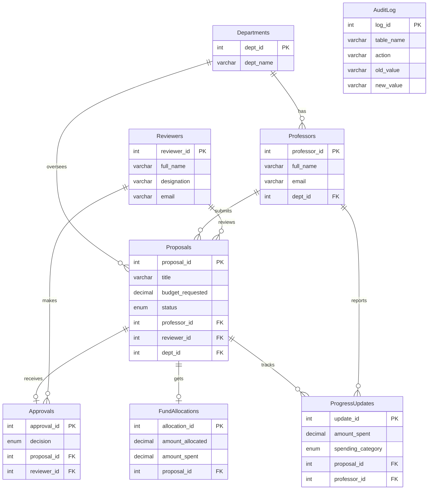

# UniGrant Project Diagrams

This file contains the Entity-Relationship (ER) Diagram and System Architecture diagram. 
These diagrams are built using **Mermaid**. Many markdown viewers (like GitHub, VS Code, or Notion) will automatically render these into beautiful visual diagrams.

## 1. Entity-Relationship (ER) Diagram
This shows how all the tables in the database are connected to each other.



---

## 2. System Architecture Diagram
This diagram illustrates the flow of data from the User Interfaces (Frontend), through the Python Flask server, down into the advanced MySQL features.

```mermaid
flowchart TD
    %% Styling to make it look a bit more "human" or sketch-like
    classDef default fill:#f9f9f9,stroke:#333,stroke-width:2px,font-family:Comic Sans MS,rx:10,ry:10;
    classDef browser fill:#e0f2fe,stroke:#0284c7,stroke-width:2px,font-family:Comic Sans MS;
    classDef server fill:#fef08a,stroke:#ca8a04,stroke-width:2px,font-family:Comic Sans MS;
    classDef db fill:#dcfce7,stroke:#16a34a,stroke-width:2px,font-family:Comic Sans MS;

    subgraph User Layer
        P[Professor Interface]:::browser
        R[Reviewer Interface]:::browser
    end

    subgraph Application Layer [Python Flask Backend]
        App[app.py - App Entry]:::server
        R_Prof[Proposals Route]:::server
        R_Prog[Progress Route]:::server
        R_Anal[Analytics Route]:::server
    end

    subgraph Database Layer [MySQL Advanced DBMS]
        DB[(Tables & Data)]:::db
        SP[[Stored Procedures]]:::db
        Trig[[Audit Triggers]]:::db
        Views[[Window Function Views]]:::db
        Evt((Event Scheduler)):::db
    end

    %% Connections
    P <-->|HTTP Requests| App
    R <-->|HTTP Requests| App

    App --> R_Prof
    App --> R_Prog
    App --> R_Anal

    R_Prof <-->|Basic SQL| DB
    R_Prog <-->|CALL record_progress()| SP
    R_Anal <-->|SELECT FROM| Views

    SP -->|Inserts / Updates| DB
    DB -->|Fires on changes| Trig
    Trig -->|Saves to AuditLog| DB
    
    Evt -.->|Runs daily at midnight| DB
```
